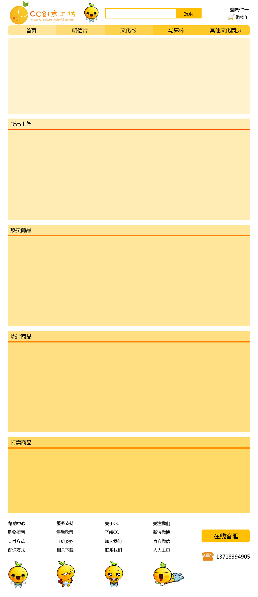
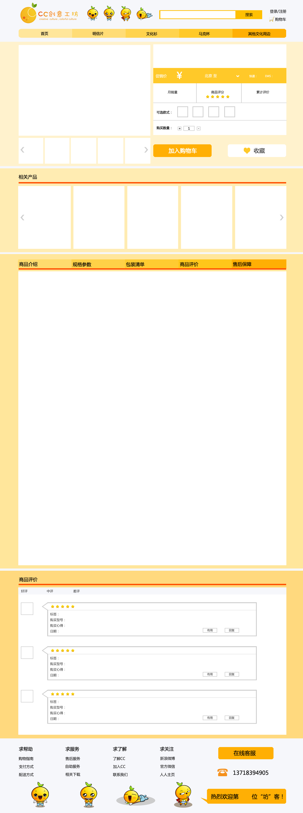

#功能与逻辑
- 功能：一个类似于小米商城的网购商城，能够实现商家开店的功能。
- 整体逻辑：
> 1. 用户进入导入页，可以是一段音乐一个视频等（增强代入感）
> 2. 等待数秒或用户点击后进入官网首页，在首页用户可以搜索商品，查看到各种推荐产品
> 3. 用户由首页进入分类页面，在分类页能展示某一分类的商品，并根据特定的规则进行排序
> 4. 用户由分类页或首页进入商品详情页，在详情页有商品的详细介绍，客户评价等产品相关内容。
> 5. 用户在详情页可点击一键购买跳转到购物车页，或点击加入购物车将商品放入购物车
> 6. 用户可以在购物车页更改商品的数量，增删商品，修改产品数量等。
> 7. 进入结算页之前，用户需进行用户注册登录等操作
> 8. 确认无误后用户进入结算页面，在结算页面用户填写地址信息，发票信息，将由地址信息确定邮费。
> 9. 用户进入支付页面进行产品支付。
> 10. 用户注册时可以选择普通注册包含手机、邮箱验证(二选一）社交帐号快速登录两种方式，商户注册需另开界面
> 11. 用户可以通过手机邮箱验证的方式来重置密码，也可以在经过确认之后删除帐号
> 12. 用户可以通过手机号、邮箱、用户名加密码的方式进行登录，但使用社交帐号注册的用户除非自己另社密码否则不能用密码进行登录
> 13. 后台管理:后台管理包含发布信息，整理信息两部分。后台按使用者不同分为如下
>> - 商家后台：商家可以通过此后台发布自己的商品，查看当前的订单,管理已经上线的商品。商家发布的商品需经验证员验证后方可上线(自家商品发布同样使用商家后台)
>> + 产品经理后台:产品经理可以上线、下线已经发布的商品，并将信息反馈到商家后台
>> + 管理员后台：管理员拥有最高的管理权限
+ 全局变量：
```python
    {'category':categorylist}
```
> + category method:
```python
         category.name 分类名称
         category.id  分类id cid
         category.small_products 是否是小件商品
```

#第一部分：商品管理及展示
## 1. 导入页:
---
- 功能: 一个很人性化的导入界面通过音视频等引导用户进入首页，导入页可在几秒内自动跳转到首页也可以由用户点击进入到首页。类似于QQ空间的导入界面 
- url: /
- urlname: store:leading
- view: leading
- template: leading.html
- request method: GET
> - request args: none
- response: 
``` python
    {'flashurl':flashurl}
```
> - flashurl: flash文件所对应的url 字符串
- link: store:home
-　sketch: 暂无
- test:
- TODO:
---
## 2.首页：
---
- 功能: 导航、产品展示，搜索。其中以产品展示为主，产品展示最新产品，热卖产品，高评价产品,特卖商品
- url: store/home
- urlname: store:home
- view: home
- template: home.html
- request method: GET
> -request args: none
- response: 
``` python
    {'newProduct':productgroupqueryset,#最新上线的前９件商品
     'hotProduct':productgroupqueryset,#热卖商品前10
     'mostCommentProduct':productgroupqueryset, #热评商品前7
     'saleProduct':productgroupqueryset,#特卖商品
     'showgallery':galleryqueryset,#展示框
    }
```
> - productgroup method:
```python
    productgroup.indeximage # 首页图片url
    productgroup.name #商品名称
    productgroup.price #价格
    productgroup.saleprice #特卖价格
    productgroup.vipprice #会员价格
    productgroup.products_set #同类不同规格的所有产品
    products_set[0].id #商品pid 用于生成链接
```
> - showgallery method:
```python
    showgallery.img #图片url
    showgallery.targeturl #图片所要链接到的地址
```
－ link:
> 1. 商品分类页
> 2. 商品详情页
> 3. 搜索页　GET 表单
> 4. 购物车　ajax方式 
- sketch: 
- test:
- TODO:
---
## 3.搜索页
---
- 功能： 实现产品搜索，如果搜索字串为空，返回全部商品，如果不为空返回选定商品，如果未找到，显示热卖商品
- url: store/search?q=keyword
- urlname: store:search
- view: views.search
- template: category.html
- request method: GET
> - request args: q 搜索关键词
- response:
```python
       {'status':statunumber #0　正常　１未找到商品　２全部商品
       　'filters': filterdict #返回所有分类选项的一个字典
         'products': productqueryset
         'total':totalnumber #总共找到的商品数量
        }
```
> - filters method:
```python 
        filters[key]=valuelist #key为分类名 valuelist为包含所有值的列表
        valuelist=[{'fid':fid,'value':value},{}...]#其中fid 用于生成过滤链接value为过滤项所对应的值
```
- link:
> 1. 加入购物车　product.productsgroup[0].id
> 2. 商品详情页　
- sketch: 暂无
- test: xss sql注入
- TODO:
> - [] 搜索功能优化
> - [] 搜索缓存
---
## 4.商品分类展示页：
---
- 功能：展现商品分类，可以按照子分类过滤，可以按照某一个排序规律进行排序
- url: /store/category/cid?fid=''&sortid=''&sort=''
- urlname: store:category
- view: views.category
- template: category.html
- request method: GET
> - request args: cid: 分类id fid 筛选id 中间以'+'分开　sortid: 排序依据　0 默认 1 上架时间 2价格 3 关注度　sort:排序方式0 降序　1升序
- response:
``` python
    { 'status':statusnumber,
      'filters':filterdict,
      'products':productqueryset
    }
``` 
- link:
> 1. 加入购物车　product.productsgroup[0].id
> 2. 商品详情页　
- 可能的错误处理： 400 bad request
---
## 5.商品详情页
---
- 功能：　展现商品的详情，包括相关的图,产品海报，常见问题，用户评论等等信息。
- url: /store/item/pid
- urlname: store:detail
- view: views.detail
- template: detail.html
- request method: GET
> - request args: pid product id
- response:
```python
    { 'status':statusnumber,# 3商品已下线
      'product':productobj,
      'recommand':recommandproduclist
    }
```
> - product method:
```
     product.name＃商品名称
     product.productgroup.price#价格
     product.productgroup.vipprice#会员价格
     product.productgroup.saleprice#促销价格
     product.productimage_set #所有展示图片
     product.parameter_set #商品参数
     parameter.name　＃参数名称
     parameter.value #参数对应的值
     product.feature #规格分类
     product.productsgroup.productdetailimage_set#商品详情信息
     product.productsgroup.comment#用户评价
     comment.content#评论内容
     comment.staff_response #客服回应
     comment.score #评分
     comment.useful #用户认为评论有用数
     comment.date＃用户评论日期
     comment.user.username＃用户名称
     
```
- link: 购物车 收藏页
- 可能的错误处理：404 not found
- sketch: 

---

##6 购物车inline
---
- 功能：页面内的购物车，显示当前加入购物车的商品
- url: /cart/inline/
- urlname: cart:inlinecart
- view: cart.views.inlinecart
- template: none
- request method:GET
- response: json '{'status':statunumber,'error':
'value':[{'imgurl':urlstr,'name':namestr,'price':pricefloat,'amount':amountinterger,'pid':productid},...]}'
- 备注: staunumber:0 访问数据正常 statunumber:4 购物车里没有商品，
- request method:POST
  POST requets 需设置“X-CSRFToken"头的值为csrftoken,其中csrftoken值在cookies 中，[代码如下](https://docs.djangoproject.com/en/1.6/ref/contrib/csrf/#ajax)：
```javascript
      var csrftoken=$.cookie('csrftoken')
            function csrfSafeMethod(method) {
    // these HTTP methods do not require CSRF protection
    return (/^(GET|HEAD|OPTIONS|TRACE)$/.test(method));
}
function sameOrigin(url) {
    // test that a given url is a same-origin URL
    // url could be relative or scheme relative or absolute
    var host = document.location.host; // host + port
    var protocol = document.location.protocol;
    var sr_origin = '//' + host;
    var origin = protocol + sr_origin;
    // Allow absolute or scheme relative URLs to same origin
    return (url == origin || url.slice(0, origin.length + 1) == origin + '/') ||
        (url == sr_origin || url.slice(0, sr_origin.length + 1) == sr_origin + '/') ||
        // or any other URL that isn't scheme relative or absolute i.e relative.
        !(/^(\/\/|http:|https:).*/.test(url));
}
$.ajaxSetup({
    beforeSend: function(xhr, settings) {
        if (!csrfSafeMethod(settings.type) && sameOrigin(settings.url)) {
            // Send the token to same-origin, relative URLs only.
            // Send the token only if the method warrants CSRF protection
            // Using the CSRFToken value acquired earlier
            xhr.setRequestHeader("X-CSRFToken", csrftoken);
        }
    }
});
```            
- request args:
   dataType: 'json' '{'operator': opnum,'pid':productid,'amount':product amount}
   operator 表示操作数 0删除 1添加 2修改产品数量
- response: json '{'status':statunumber,'error':errorstring}'
    statubumber: 0表示删除成功，5没有购买此商品 6 商品缺货 7 错误的操作码
    errorstring: 错误信息
---
##7 购物车
---
- 功能：商品汇总页，显示当前的所有商品,并进行相关商品推荐
- url: /store/cart/
- urlname: cart:cart
- view: store.views.cart
- template: none
- request method: GET 
> - request args: none
- response:
```
    {'smallproduct':productgroupqueryset,#小商品
    'recommand':products，#特别推荐商品
    }
```
> -method: 同2首页
- 备注： 购物车内的商品通过ajax 方式访问6-inlinecart得到
- link: 订单提交页，返回继续购物
---
#第二部分：用户注册模块
##8 注册页面
- 功能： 注册页面，提供常规的手机 邮箱注册方法,用户填写的表单通过ajax的方式异步传输到对应的服务端，进行注册
- url: /user/register/ 
- urlname: user:register
- view user.views.user
- template: 'user/register.html'
- request method: GET
- response: None
##9 手机注册
- 功能：处理手机注册所需的表单
- url: /user/register/mobile
- urlname: user:mobile
- view user.views.register_mobile
- template: None
- request method: POST
> - request args:JSON
```
    '{'mobile':mobilestring,#mobile str
      'verifycode':verifycodestring,#验证码
      'password':passwordstring,#密码字符串
      ’confirmpass‘:string,#确认密码
      }'
```
> -备注：ajax提交方法同上
- resonse:JSON
```'{'status':statunumber,#错误码
     ’error':error str if have,#出错信息
    }'
    8#手机号码未经过验证
    9#验证码不正确
    10#密码前后不一致
    0#注册成功  
    14#Post数据不完全
    13# 未同意用户协议
    17#验证码已过期
```
- 可通的错误处理：当以GET请求时，返回400 bad request
- TODO: 密码加密传输
- link: 请求发送手机验证码
##10  邮箱注册
- 功能：处理邮箱注册的表单
- url: /user/register/email
- urlname: user:email
- view: user.views.register_email
- template:None
- request method: POST
> - request args:JSON
```
   '{'email':emailstring,#
      'verifycode':verifycodestring,
      'password':passwordstring
      'confirmpass':string
     }'
```
- response: 同上
``` 11#内部错误
    12#邮箱已注册 
    1４#POST数据不完全
    13#未同意用户协议
```
##11 邮箱激活
- 功能：通过访问该url用户可以激活自己的帐号
- url: /user/active/?P sign/?P usernamehash/
- urlname: user:active
- view: user.views.active_email
- template: 'user/active.html'
- request method: GET
> -request args: sign 签名 usernamehash  base64编码的用户账户
- response:
        {'message':messagestr}
## 12 用户协议
- 功能:展示用户协议
- url: /user/aggrement/
- view: views.useraggrement
- urlname: aggrement
- template: 'user/useragreement.html'
- request method: GET
> -request args: None
- respond: none
## 13